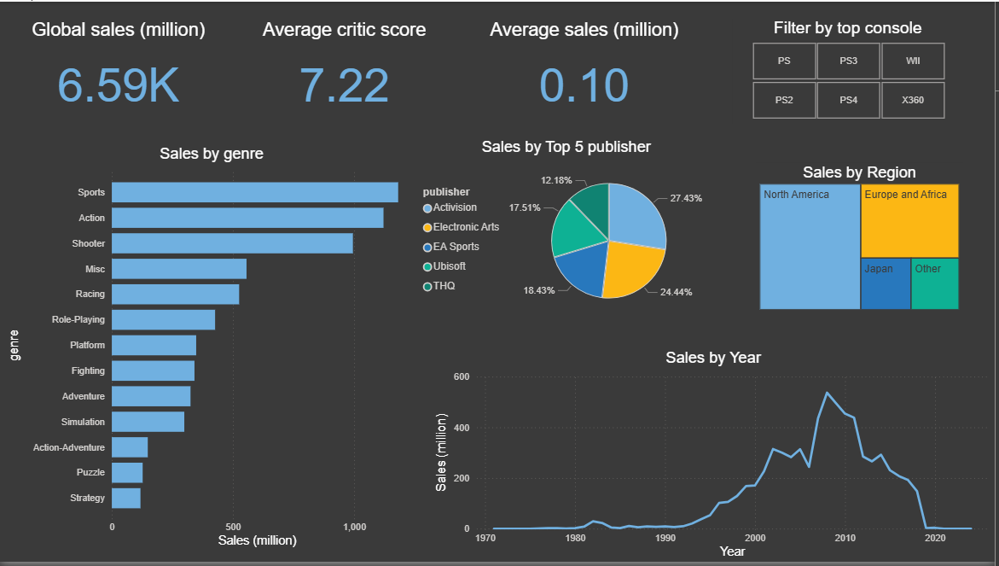

#  Video Game Sales Analysis Dashboard

This project explores the global video game industry through sales data, uncovering patterns in genre performance, regional popularity, top publishers, and historical trends. Using SQL for cleaning and Power BI for interactive visualization, this dashboard highlights how gaming has evolved across time, platforms, and regions.

##  Project Objective

The goal of this project is to:
- Analyze global video game sales by genre, region, year, and publisher.
- Identify high-performing platforms and publishers.
- Visualize trends and insights using an interactive dashboard.
- Understand which genres and consoles dominated different time periods.

##  Dataset Overview

The dataset contains sales information for a large number of video games released across various consoles. columns include:

- Game title, release date, console
- Publisher, developer, genre
- Critic score, total sales, and regional sales (North America, Japan, Europe/Africa, and Other)

The raw data was cleaned and preprocessed using SQL to ensure consistency and accuracy.

##  Tools  Used

- **SQL Server** for data cleaning and transformation (`vg_sql_script.sql`)
- **Power BI** for building interactive visualizations (`vg_sales_dashboard.pbix`)
- **CSV Files** for raw and cleaned datasets:
  - `vg_sales_raw.csv`
  - `vg_sales_clean.csv`
- **Dashboard Preview**: `vg_Sales.png`
- **Data Dictionary**: `vg_sales_dictionary.csv`

##  Dashboard Insights

Findings from the dashboard:

-  **Global sales** exceed **6,590 million units**.
-  **Average critic score** is **7.22**, with an **average game selling 0.10 million units**.
-  **Top-selling genres**: Sports, Action, Shooter.
-  **Regional breakdown** shows North America dominating sales, followed by Europe/Africa and Japan.
-  **Top consoles** include PS2, PS3, PS4, Wii, and Xbox 360.
-  **Top publishers**: Activision, Electronic Arts, EA Sports, Ubisoft, and THQ.
-  **Sales peaked between 2005–2010** and have declined sharply after 2015.

##  Data Cleaning Highlights (SQL)

- Removed duplicate records using `ROW_NUMBER()`.
- Trimmed whitespace from text columns.
- Replaced null or invalid sales values with 0.
- Standardized console names to uppercase.
- Handled inconsistent or out-of-range critic scores.
- Removed rows with missing critical information.

> For full cleaning logic, refer to [`vg_sql_script.sql`](vg_sql_script.sql)

---

This project demonstrates the power of combining SQL and Power BI to gain insights into industry-level data. It’s a perfect example of data storytelling through visuals.

